<!-- ═══════════════════════════════════════════════════════════════════════
     🌴 E D S O N   R O C H A   ·   V A P O R W A V E   R E A D M E
     ═══════════════════════════════════════════════════════════════════ -->

<div align="center">

<!-- ─── Header WAVE ─── -->


<!-- ─── Avatar Scanline ─── -->


<br/><br/>

```
▶ N O S T A L G I A  ·  懐かしい  ·  S Y S T E M S
```

<!-- ─── Status Badges ─── -->


<br/><br/>

<!-- ─── Social Buttons ─── -->
<a href="https://www.linkedin.com/in/edson-rocha-da-silva-300030379/">
  
</a>
<a href="https://github.com/eddieJPNG">
  
</a>
<a href="https://wa.me/qr/OZ354YNZCNIAG1">
  
</a>
<a href="https://portfolio-edsonrochadev.vercel.app">
  
</a>

</div>

---

<div align="center">

## `◈` **about.exe**

</div>

```python
class EdsonRocha:
    def __init__(self):
        self.name       = "Edson Rocha da Silva"
        self.role       = "Back-end Developer · Blockchain Enthusiast"
        self.education  = "Tecnólogo em Sistemas de Computação @ UESPI"
        self.focus      = ["RESTful APIs", "Clean Code", "Modularização em camadas"]
        self.stack      = ["Python", "FastAPI", "Flask", "NestJS", "TypeScript",
                           "Node.js", "MySQL", "SQLite", "React", "Solidity", "Move"]
        self.values     = ["clean code", "escalabilidade", "aprendizado contínuo"]
        self.languages  = {"pt": "Nativo", "en": "Intermediário", "es": "Básico"}

    def current_mission(self) -> str:
        return "Construir soluções escaláveis, modulares e com código limpo."
```

> 🎓 **Tecnólogico em Sistemas de Computação** — Universidade Estadual do Piauí (UESPI)
> 🧠 **Desenvolvedor Back-end** focado em **APIs RESTful**, integração de sistemas e arquitetura modular
> ⚡ Sistemas web com **FastAPI · Flask · NestJS · SQLAlchemy**
> ⛓️ Explorando o universo **Web3** — Dapps em **Solidity** e **Move (Sui)**
> 🚀 Código limpo, escalável e aprendizado contínuo, sempre

---

<div align="center">

## `◈` **stack.json**

### ─── Back-end ───


### ─── Front-end ───


### ─── Banco de Dados & Infra ───


### ─── Blockchain & Web3 ───


### ─── Ferramentas ───


</div>

---

<div align="center">

## `◈` **stats.log**


<br/><br/>


<br/><br/>



<br/><br/>

<picture>
  <source media="(prefers-color-scheme: dark)" srcset="./dist/activity-graph-dark.svg" />
  <source media="(prefers-color-scheme: light)" srcset="./dist/activity-graph.svg" />
  
</picture>

</div>

---

<div align="center">

## `◈` **projects.exe**

</div>

<table align="center">
<tr>
<td width="50%" valign="top">

### 🔗 **Webbb3 — On-chain Voting Dapp**
`fev 2026 · jun 2026`

Sistema de votação descentralizado com **smart contract em Solidity**, deploy direto na blockchain via Remix IDE + MetaMask. Consolidado como **Dapp** completo com interface React.

**Stack:** `Solidity` `React` `TypeScript` `Bootstrap` `MetaMask`

🔗 [github.com/eddieJPNG/webbb3_dapp_course_blockchain](https://github.com/eddieJPNG/webbb3_dapp_course_blockchain)

</td>
<td width="50%" valign="top">

### 🎨 **Sui NFT Hub**
Sistema desenvolvido como prática de **Dapps na rede Sui**, escrito em **Move**, com smart contract deployado direto na **Mainnet**. Interface construída com a biblioteca oficial da Sui.

**Stack:** `Move` `Sui` `HTML5` `CSS3` `JavaScript`

🔗 [github.com/eddiejPNG/Sui_Nft_Hub_Project](https://github.com/eddiejPNG/Sui_Nft_Hub_Project)

</td>
</tr>
<tr>
<td width="50%" valign="top">

### 📋 **ConvMonitor**
`mai 2026 · jun 2026`

Aplicação web para gerenciamento de **convênios de estágio da UESPI**, com painéis por perfil de acesso, geração de PDFs e notificações internas.

**Stack:** `Python` `FastAPI` `Flask` `SQLAlchemy` `Flet` `MySQL`

🔗 [github.com/pedroaguircd/sistema-convenios](https://github.com/pedroaguircd/sistema-convenios)

</td>
<td width="50%" valign="top">

### 🌴 **Vaporwave Portfolio**
`jul 2026 · presente`

**SPA** que funciona como cartão de visitas digital avançado, unindo estética vaporwave imersiva, animações com Framer Motion e formulário via EmailJS.

**Stack:** `React` `TypeScript` `Vite` `Tailwind` `Vitest`

🔗 [portfolio-edsonrochadev.vercel.app](https://portfolio-edsonrochadev.vercel.app)

</td>
</tr>
</table>

---

<div align="center">

## `◈` **experience.timeline**

```
╭─────────────────────────────────────────────────────────────────╮
│  🌴  INSTITUTO JANELA PARA O MUNDO                              │
│      Líder de Projeto — Hackathon                               │
│      fev 2022 ──────────────────────────── set 2022             │
│      ▸ Sistema de vendas no-code (Wix + Canva)                  │
│      ▸ +20% eficiência de vendas para artesã local              │
│      ▸ Gestão de time de 6 devs · entregas ágeis                │
╰─────────────────────────────────────────────────────────────────╯

╭─────────────────────────────────────────────────────────────────╮
│  🚀  DO PIAUÍ PARA O MUNDO                                      │
│      Desenvolvedor — Programa Estadual de Tecnologia            │
│      ▸ Time ConvMonitor (finalista)                             │
│      ▸ Models & Schemas no backend (SQLAlchemy)                 │
│      ▸ Integração banco ↔ backend                               │
│      ▸ Imersão 4 dias — Teresina · viagem técnica Rio de Janeiro│
╰─────────────────────────────────────────────────────────────────╯
```

</div>

---

<div align="center">

## `◈` **certifications.log**


<br/>

## `◈` **languages.cfg**


</div>

---

<div align="center">

## `◈` **connect.sys**

<a href="https://www.linkedin.com/in/edson-rocha-da-silva-300030379/">
  
</a>
<a href="https://github.com/eddieJPNG">
  
</a>
<a href="https://wa.me/qr/OZ354YNZCNIAG1">
  
</a>
<a href="mailto:contato@edsonrocha.dev">
  
</a>

<br/><br/>

<!-- ─── Snake Animation ─── -->
<picture>
  <source media="(prefers-color-scheme: dark)"
    srcset="https://raw.githubusercontent.com/eddieJPNG/eddieJPNG/output/github-contribution-grid-snake-dark.svg" />
  <source media="(prefers-color-scheme: light)"
    srcset="https://raw.githubusercontent.com/eddieJPNG/eddieJPNG/output/github-contribution-grid-snake.svg" />
  
</picture>

<br/><br/>

```
▶ // BUILD WITH 懐かしい · NOSTALGIA.EXE · EOF ◀
```


</div>

